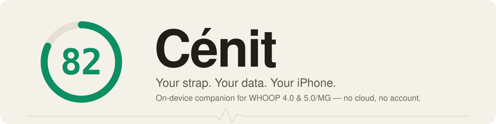

<p align="center">
  
</p>

<h1 align="center">Cénit</h1>

<p align="center"><b>Your strap. Your data. Your iPhone. On-device, no cloud.</b></p>

<p align="center">
  
  
  
  
  <a href="LICENSE"></a>
</p>

<p align="center">
  <a href="#download">⬇&nbsp;Download</a> ·
  <a href="#features">Features</a> ·
  <a href="docs/PROTOCOL.md">Protocol</a> ·
  <a href="docs/ARCHITECTURE.md">Architecture</a>
</p>

<p align="center"><sub>Cénit began life as <b>Cénit</b> — the name the repository still carries.</sub></p>

---

## Download

Cénit is an iOS app — you build it from source:

| Platform | Build | Notes |
|---|---|---|
| **iOS** | Build from source — see [`docs/BUILD.md`](docs/BUILD.md) | App + widgets + HealthKit. **Not distributed as a download:** iOS has no anonymous install path — the App Store and TestFlight both require a real Apple Developer identity — so it's build-it-yourself in Xcode. |

See [`docs/BUILD.md`](docs/BUILD.md) for the full build instructions.

Everything runs **on your device**. The built-in Coach answers locally, with no
network at all; the only things that can ever leave your iPhone are the optional
external AI Coach (only after you add your own API key) and the opt-in exercise
media downloader (off by default — see [Privacy](#privacy)).

---

Cénit is a standalone, fully **on-device** companion app for the strap on your
wrist (4.0 and 5.0/MG). It pairs directly with the strap over Bluetooth, stores
everything on your own iPhone in SQLite, imports your existing strap and Apple
Health history, and computes recovery, strain, HRV, and sleep **locally**, with no
account and no cloud.

It is built on prior community reverse-engineering work and exists for one
reason: to let someone who owns a strap read **their own biometric data**
from **their own device**, on a machine **they** control.

> **Not affiliated with WHOOP.** Cénit is an independent, unofficial
> interoperability project. It is not affiliated with, endorsed by, or connected
> to WHOOP, Inc. "WHOOP" is used only to identify the hardware Cénit talks to. Use
> it only with a device you own, and not in breach of any agreement that applies
> to you. **Cénit is not a medical device**; every derived metric is an
> approximation, not clinical data. See [`DISCLAIMER.md`](DISCLAIMER.md).

---

## Contents

- [Why Cénit](#why-cénit)
- [Features](#features)
- [Platform status](#platform-status)
- [Architecture](#architecture)
- [Quickstart](#quickstart)
- [How your data flows](#how-your-data-flows)
- [Privacy](#privacy)
- [Attribution](#attribution)
- [Disclaimer](#disclaimer)
- [License](#license)
- [Docs](#docs)

---

## Why Cénit

You bought the strap. The biometric stream it produces is yours. Cénit is built on
that premise:

- **Own your data.** Cénit reads heart rate, R-R intervals, SpO₂, skin temperature,
  respiration, accelerometer/gravity, battery, and event data straight off the
  strap over Bluetooth and writes it to a local SQLite database. Nothing is
  uploaded anywhere.
- **Account-free and on-device.** Cénit never logs into a WHOOP account and never hits
  a WHOOP server. It does not bypass any login, paywall, or DRM; it simply talks to
  a device you own and reads data you generated.
- **Bring your history.** Already have years of data in the official app or in
  Apple Health? Import the WHOOP CSV export and/or your Apple Health `export.xml`
  once, and it's permanently on your machine.
- **Transparent math.** Recovery, strain, HRV, and sleep are recomputed on-device
  from documented, citable methods (Task Force 1996 HRV, Karvonen %HRR, Edwards /
  Banister TRIMP, Tanaka HRmax, and so on). The algorithms are approximations of —
  not reproductions of — any proprietary model, and every analyzer file documents
  exactly what it does.

---

## Features

The app is organized into **five tabs**.

| Tab | What's there |
|---|---|
| **Today** | The home dashboard. One dominant number — your **recovery** — and **today's verdict** (Primed / Balanced / Strained / Run down) on a 24-hour dial, with the drivers behind it. Below: a grid of stat tiles (day strain, sleep, HRV, heart rate, resting HR, blood oxygen, steps, stress) each with a 14-day sparkline, recent workouts, and a data-sources footer. Pull down to sync the strap and recompute. **Live** — the real-time HR/frame stream (~1 Hz) — opens as a full-screen cover from here. |
| **Body** | Your biometrics in depth. A unified **metric-detail** surface with dedicated reads for recovery, strain, **sleep** (hypnogram, stage breakdown, efficiency, schedule regularity), stress, skin temperature, **fitness age**, plus HRV, resting HR, SpO₂, respiratory rate and steps — and long-range **trends** across all of them. Apple Health data is reconciled here too. |
| **Coach** | A single screen built as a loop — **Discover → Test → Act → Learn**. At the top, your **decision for today** (what to do) with recovery as the evidence. Below: **Ask your data** — free-text questions answered **on-device** (see [the Coach](#the-coach--ask-your-data-on-device)); **What works for you** — the habits most associated with your best recovery, as a causal registry; **Findings** — anomalies, trends and correlations the on-device engine surfaces; **Log your day** — a Yes/No journal that feeds your levers; and **N-of-1 experiments** — test one lever for 7 days and get an honest verdict (held up / didn't / not enough signal). |
| **Train** | Two strap-native tools. **Breathe** — HRV **haptic breathing biofeedback**: the strap both *measures* HRV (R-R intervals) and *buzzes* its haptic motor, so Cénit paces your breath with felt cues and shows live HR + rolling RMSSD. Presets: Relax 4-6, Coherence 5.5, Box 4-4. **Intervals** — a **silent haptic HIIT timer**: the strap buzzes every transition (triple-buzz into work, single into rest, 3-2-1 tick, long buzz on finish) so you train hands-free, with a glanceable visual fallback when no strap is connected. |
| **Settings** | Profile, preferences, the in-app **What's new** changelog, and an opt-in **Experimental** section (WHOOP 5/MG protocol probes). A **More** area holds the power-user screens: **Metric Explorer** (interrogate any single metric over time), **Compare** (plot two metrics together), **Workouts** (detected sessions with strain + HR detail), **Data Sources** (one-tap import of a WHOOP CSV or Apple Health export, plus live-strap status) and **Automations** (opt-in HealthKit write-back). |

There is also a first-run **onboarding wizard** that sets expectations
(independent/experimental, WHOOP 4.0 vs 5/MG, on-device only), Home-screen /
Lock-screen **widgets**, and an in-app **"What's new"** changelog shown after each
update.

### The Coach — "Ask your data", on-device

The Coach used to be a chat with an external LLM. It isn't anymore. **Ask your data** now answers your free-text questions in three tiers, and the default path never touches the network:

- **On-device (Apple Intelligence).** On an iPhone with Apple Intelligence (iOS 26+), you type an open question — *"why did I wake up tired?"* — and your phone's own model answers, **with no network**. A deterministic engine (`CoachGrounding`, in `StrandAnalytics`) builds the answer from **your real numbers** and the model only **phrases it** — so it never invents one of your metrics. A guard rejects any answer that states a figure the engine didn't.
- **Essential mode.** On an iPhone without Apple Intelligence, you answer with pre-armed questions that use the same engine numbers — fully deterministic, still on-device.
- **External AI (optional, bring-your-own-key).** For deeper, open-ended answers you can opt into an external LLM with **your own** OpenAI/Anthropic key. This is the **one** feature that ever uses the network, and it sends only a short text summary of recent metrics plus your question — never raw streams or identifiers. Off until you add a key. See [`docs/PRIVACY_SECURITY.md`](docs/PRIVACY_SECURITY.md).

---

## Platform status

Cénit's logic lives in cross-platform Swift packages. The iOS app pairs
with the strap and **scores recovery, strain and sleep on your own device** — no
import required.

| Platform | Status |
|---|---|
| **iOS** | ✅ The app (`Cenit`, SwiftUI, **iOS 17+**) — app target + widgets + HealthKit. Pairs over BLE, offloads the strap's history, and scores recovery / strain / sleep on-device. **Build-from-source only, not distributed:** iOS has no anonymous distribution path (App Store and TestFlight both require a real Apple Developer identity), which is fundamentally at odds with this project staying anonymous. |

Cénit is **iOS-only** today — earlier macOS and Android experiments have been
retired. The protocol facts and framing/CRC rules are language-agnostic, so the
wire behavior is portable and a future port is technically possible; none is in
development right now.

### Strap support

Cénit is an independent, **experimental** project — capable, but a work in progress.

| Strap | Status |
|---|---|
| **WHOOP 4.0** | ✅ The tested, supported path. Live HR, recovery, strain, sleep, history offload — the full experience. |
| **WHOOP 5.0 / MG** | 🧪 **Live heart rate, battery and the low-level history offload work** (confirmed on real hardware). Pick "WHOOP 5.0 / MG" before connecting — and see the pairing note below, because you can't just scan for it. The derived 5/MG metrics (recovery, strain, sleep) are still being reverse-engineered; there's an opt-in **Settings → Experimental** toggle that records raw "puffin" frames to help map the protocol. |

> ### Pairing a WHOOP 5.0 / MG — read this first
>
> A WHOOP strap holds an encrypted Bluetooth **bond with only one device at a time**, and yours is
> normally bonded to the **official WHOOP app** on your phone. **You can't just scan for it in Cénit** —
> if the strap is still bonded to the WHOOP app, Cénit's pairing is refused and the strap log shows
> *"Encryption is insufficient"* / *"bond refused."* (Live **heart rate** is the exception — it rides the
> standard Bluetooth heart-rate profile, so it streams without a bond. But pairing — needed for the
> deeper features — does not.)
>
> **To pair properly:**
> 1. **Close the official WHOOP app** on your phone (fully quit it, or turn that phone's Bluetooth off) so
>    it isn't holding the bond.
> 2. **Put the strap in pairing mode** — on a 5.0/MG, **tap the band repeatedly** (firm taps on the
>    sensor) until the **LEDs flash blue**.
> 3. In Cénit: **Today → Live → choose "WHOOP 5.0 / MG" → Scan & Connect.** Success looks like
>    *"CLIENT_HELLO acked — link established"* in the strap log (not *"bond refused"*). It can take a
>    couple of attempts.
>
> **Only one device at a time.** Because the strap holds a single bond, don't leave it connected to your
> phone *and* another device (or the WHOOP app) at once — live heart rate will still show on all of them
> (that rides the bond-free standard profile), but **none** of them will have the real encrypted bond.
> If HR streams fine yet **buzz, alarm, double-tap and history don't work**, that's the tell: the strap
> isn't truly bonded to this device. Free it from everything else, then pair here.
>
> Bonding to Cénit may take the strap's bond away from the WHOOP app, so the official app might need to
> re-pair afterwards. This is the **hardest part of 5/MG support** — if it refuses, you're almost
> certainly still bonded to the WHOOP app (or another device); free the strap and retry.

The app always tells you what's live now versus still building, both in onboarding and on each screen.

### What to expect when you start

Cénit computes your scores on your own device, so like any recovery wearable it
needs a little data before everything fills in:

- **Live heart rate** shows the moment the strap connects.
- **Strain and sleep** appear after you've worn it and synced — the strap's last
  ~14 days offload automatically over the first few minutes.
- **Recovery** needs a few nights for the app to learn your personal baseline,
  then sharpens each night. WHOOP makes you wait for the same reason.
- **In a hurry?** Import your WHOOP export in **Settings → Data Sources** and your
  full history fills in about a minute.

---

## Architecture

The repository is split into platform-pure Swift packages plus the iOS app target
(`Cenit`). All packages declare both `.iOS(.v16)` and `.macOS(.v13)` so the pure
logic builds and tests without an app or a strap;
framework-specific UI is guarded with `#if canImport(UIKit)` / `#if canImport(AppKit)`.

```
Cenit/                 SwiftUI app layer — BLE, Collect, Data, Screens, System (built by the Cenit target)
CenitApp/              iOS app shell — HealthKit, widgets, intents
CenitWidgets/          WidgetKit extension (Home / Lock-screen widget)
CenitShared/           code shared between the app and the widgets
Packages/
  BiometricStreams/     neutral vocabulary of decoded biometric rows (pure, zero deps)
  WhoopProtocol/        BLE frame parsing, CRC, command/event/packet decode (pure, no CoreBluetooth)
  CenitStore/           GRDB/SQLite persistence (versioned migrations, through v12)
  StrandAnalytics/      HRV / recovery / strain / sleep / correlation math + Coach grounding (pure, DB-free)
  StrandImport/         WHOOP CSV + Apple Health importers
  StrandDesign/         SwiftUI design system (palette, components, charts)
Tools/                  developer scripts (localization, screen captures, protocol decode)
Fixtures/               sample WHOOP export for tests
```

> The packages keep their original `Whoop*` / `Strand*` names from the Cénit era;
> the app layer was renamed to `Cenit/` with the rebrand.

### `WhoopProtocol` — the reverse-engineering core

Platform-pure (no CoreBluetooth import) so it runs in tests and CLI tools
unchanged. It decodes the on-wire frame format for both strap generations:

```swift
public enum DeviceFamily: String, Sendable, CaseIterable {
    case whoop4   // CRC8 (poly 0x07) header check; service 61080001-…
    case whoop5   // CRC16-Modbus header check, "puffin" packet types; service fd4b0001-…
}
```

Decoding is schema-driven (`Resources/whoop_protocol.json`) and includes CRC8,
CRC16-Modbus, and zlib CRC-32 implementations, frame framing, value
interpretation, and historical-stream reassembly. The app layer (`Cenit/BLE/`,
`Cenit/Collect/`) wraps these UUID *strings* in `CBUUID` and handles bonding,
offload, and live notifications.

### `CenitStore` — local SQLite via GRDB

Everything is stored on-device in SQLite (using
[GRDB.swift](https://github.com/groue/GRDB.swift)). The schema is a versioned
migrator (`Database.swift`, currently through **`v12`**). The decoded-stream
tables created in `v1`–`v3`:

```sql
CREATE TABLE hrSample      (deviceId TEXT, ts INTEGER, bpm INTEGER, PRIMARY KEY(deviceId, ts));
CREATE TABLE rrInterval    (deviceId TEXT, ts INTEGER, rrMs INTEGER, PRIMARY KEY(deviceId, ts, rrMs));
CREATE TABLE spo2Sample    (deviceId TEXT, ts INTEGER, red INTEGER, ir INTEGER, PRIMARY KEY(deviceId, ts));
CREATE TABLE skinTempSample(deviceId TEXT, ts INTEGER, raw INTEGER, PRIMARY KEY(deviceId, ts));
CREATE TABLE respSample    (deviceId TEXT, ts INTEGER, raw INTEGER, PRIMARY KEY(deviceId, ts));
```

Later migrations add server-derived metric caches (`sleepSession`, `dailyMetric`),
the journal and workout tables, a generic long-format `metricSeries` store (v9),
WHOOP 5 step counting (v10–v11), and the **N-of-1 `experiment`** table (v12).

### `StrandAnalytics` — transparent, on-device math

Pure, database-free analyzers. Each is documented and grounded in published
methods (and is explicitly an approximation, not a reproduction of any proprietary
model):

| File | Computes |
|---|---|
| `HRVAnalyzer.swift` | RMSSD + SDNN from R-R intervals (Task Force 1996), with range + Malik ectopic filtering. |
| `RecoveryScorer.swift` | A 0–100 recovery score: HRV-dominant z-score (on the log scale, lnRMSSD) + logistic composite vs personal baselines. |
| `StrainScorer.swift` | A 0–21 logarithmic strain scale from %HRR (Karvonen) and Edwards / Banister TRIMP. |
| `SleepStager.swift` | Sleep/wake detection + approximate 4-class staging from cardiorespiratory + gravity features. |
| `ReadinessEngine.swift` | The Today verdict — HRV vs baseline (Plews/Buchheit), RHR drift (Lamberts), respiratory-rate drift, load balance (ACWR, Gabbett) and monotony (Foster). |
| `CorrelationEngine.swift`, `BehaviorInsights.swift` | Pearson r / OLS / lagged correlations, with Student-t *p*-values and FDR correction; behavioral insights. |
| `CoachGrounding.swift`, `ExperimentVerdict.swift` | Deterministic grounding for the on-device Coach, and the N-of-1 experiment verdict. |

### `StrandImport` — bring your own history

- **WHOOP CSV export** (`WhoopExportImporter.swift`): header-name-driven, tolerant
  parser for `physiological_cycles.csv`, `sleeps.csv`, `workouts.csv`, and
  `journal_entries.csv`, from a folder or `.zip`. The same schema covers WHOOP 4 /
  5 / MG.
- **Apple Health export** (`AppleHealthImporter.swift`): a **streaming** SAX parser
  (`XMLParser`) for `export.xml` (which can exceed 1 GB), with correlation-dedupe,
  unit normalization (e.g. SpO₂ fraction → %), and sleep-stage mapping.

### `StrandDesign` — the SwiftUI design system

Palette, typography, motion, and reusable components/charts — no external UI
dependencies. It carries **two languages**: the **«Instrumento diurno»** daytime
language (warm paper, one dominant number, color only in the datum) that is
canonical for new and redesigned screens, and the original **dark** system that
remaining legacy screens still use.

---

## Quickstart

**Requirements:** a recent Xcode and an iPhone on **iOS 17+** to install on. The
on-device Coach is built with Apple's **FoundationModels** framework, so building
it needs **Xcode 26** and it only runs on an iPhone with **iOS 26 + Apple
Intelligence**; on anything older the Coach compiles out and falls back to
"Essential mode". To pair live you need your own WHOOP strap; to just explore, you
can import a CSV / Apple Health export instead.

The Xcode project is generated from [`project.yml`](project.yml) with
[XcodeGen](https://github.com/yonaskolb/XcodeGen).

```bash
# 1. Clone
git clone <your-fork-url> cenit
cd cenit

# 2. (Re)generate the Xcode project from project.yml
brew install xcodegen   # if you don't have it
xcodegen generate

# 3. Open in Xcode, then select the Cenit scheme and run on your iPhone.
```

Notes:

- Product, scheme and module are **Cenit**; the app's display name is **Cénit**.
  Set your own bundle id and signing team in `project.yml` before building to your
  device.
- Swift Package Manager resolves the only third-party dependencies automatically:
  **GRDB.swift** (SQLite) and **ZIPFoundation** (export unzip).
- Run the tests from Xcode (the app's test target + each package's test target),
  or per-package with `swift test` inside `Packages/<Name>/`.

To explore without an Xcode project, the packages build on their own:

```bash
cd Packages/WhoopProtocol && swift build && swift test
```

See [`docs/BUILD.md`](docs/BUILD.md) for the full build guide.

---

## How your data flows

```
WHOOP strap ──BLE──▶ Cenit/BLE + Cenit/Collect ──▶ WhoopProtocol (decode)
                                                          │
WHOOP CSV  ─┐                                             ▼
Apple Health├─▶ StrandImport (parse) ───────────▶ CenitStore (local SQLite)
 export.xml ─┘                                            │
                                                          ▼
                                            StrandAnalytics (recovery/strain/
                                            HRV/sleep, on-device)
                                                          │
                                                          ▼
                                            Cenit (SwiftUI) + StrandDesign
```

Every arrow stays on your machine.

---

## Privacy

**On-device by design.** Cénit has no server, no telemetry, and no account. Your
strap data, imports, and computed metrics live in a local SQLite database on your
device and never leave it.

The built-in Coach ("Ask your data") answers **on-device** — via Apple
Intelligence when available, or a deterministic engine otherwise — with **no
network**. There are exactly two exceptions in the whole app, both off by default:

- The **optional external AI Coach**: off until you add your own API key, and
  even then it sends only a short text summary of recent metrics plus your
  question, never raw streams or identifiers.
- The **opt-in exercise media downloader** ("Descargar biblioteca de
  ejercicios" in Ajustes): off by default. If you turn it on, Cénit downloads
  exercise thumbnails and short video loops from ExerciseDB (a third-party
  service, via RapidAPI) and caches them on your iPhone forever, so they work
  offline afterward. Only your IP address and the exercise's name are sent to
  that service — no other data about you or your workouts ever is. Turning it
  off stops future downloads without deleting what's already cached; a
  separate "Borrar media descargada" button clears the cache.

See [`docs/PRIVACY_SECURITY.md`](docs/PRIVACY_SECURITY.md).

---

## Attribution

Cénit stands on community reverse-engineering and interoperability work. With
thanks:

- **`johnmiddleton12/my-whoop`** — the WHOOP 4.0 BLE protocol; the `WhoopProtocol`
  and `CenitStore` packages and the collection logic are adapted from this work.
- **`b-nnett/goose`** — the WHOOP 5.0 / MG BLE reverse-engineering (the `fd4b0001-…`
  service family, CRC16-Modbus header, and "puffin" packet types) that Cénit's
  WHOOP 5.0 path is ported from.
- **`groue/GRDB.swift`** — SQLite persistence.
- **`weichsel/ZIPFoundation`** — export unzipping.

Cénit contains no WHOOP proprietary code, firmware, logos, or assets, and performs
no DRM circumvention. Full detail in [`ATTRIBUTION.md`](ATTRIBUTION.md).

---

## Disclaimer

Cénit is an independent, unofficial, non-commercial interoperability project. It is
**not affiliated with, endorsed by, or connected to WHOOP, Inc.** All references to
"WHOOP" are nominative — used only to identify the third-party hardware Cénit
interoperates with.

**Cénit is not a medical device.** Heart rate, HRV, recovery, strain, sleep stages,
SpO₂, respiratory rate, and skin temperature are **approximations** computed from
published methods. They are not clinically validated and are not medical advice. Do
not use them to diagnose, treat, or make health decisions — consult a qualified
professional.

Provided **as-is**, with **no warranty**, for **personal and educational use**. You
use it at your own risk. Read the full notice in [`DISCLAIMER.md`](DISCLAIMER.md).

---

## License

Cénit is **source-available** under the [PolyForm Noncommercial License 1.0.0](LICENSE):
**free for personal and other non-commercial use** — read it, run it, fork it, and
contribute. Commercial use is not granted by this license. (PolyForm Noncommercial is
a proper software license with patent terms; it is deliberately *not* an OSI
"open-source" licence, because that would permit the commercial use this project's
non-commercial nature rules out.)

The license covers Cénit's own original code and docs. Protocol facts (frame layouts,
command numbers, byte offsets) are uncopyrightable and free to reuse; bundled
dependencies keep their own licenses (GRDB.swift and ZIPFoundation are MIT — see
[`NOTICE`](NOTICE)). By opening a pull request you agree your contribution is licensed
under the same terms — see [`docs/CONTRIBUTING.md`](docs/CONTRIBUTING.md).

---

## Docs

- [`docs/BUILD.md`](docs/BUILD.md) — full build & install guide.
- [`docs/ARCHITECTURE.md`](docs/ARCHITECTURE.md) — the system map (pipeline, package boundaries, actor model, storage schema).
- [`docs/PROTOCOL.md`](docs/PROTOCOL.md) — the WHOOP BLE protocol facts.
- [`docs/PRIVACY_SECURITY.md`](docs/PRIVACY_SECURITY.md) — exactly what stays on-device and what the optional Coach sends.
- [`docs/CONTRIBUTING.md`](docs/CONTRIBUTING.md) — repository layout, build/test, design-system rules, BLE safety contract.
- [`CHANGELOG.md`](CHANGELOG.md) — release history and what to expect (also shown in-app under **What's new**).
- [`DISCLAIMER.md`](DISCLAIMER.md) · [`ATTRIBUTION.md`](ATTRIBUTION.md) — trademark/medical notice and full credits.
